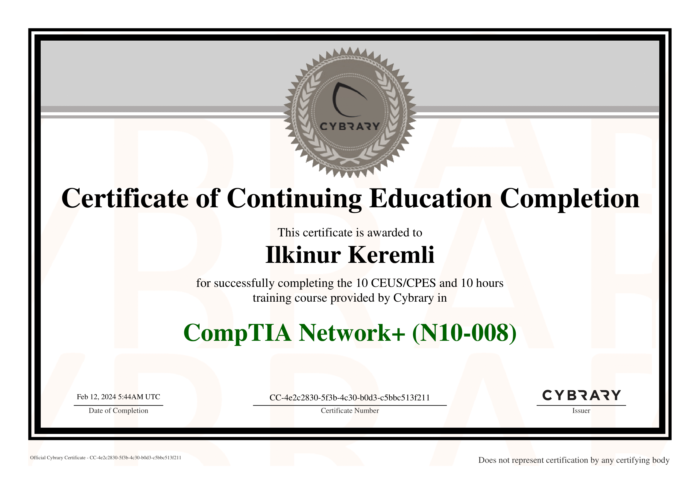
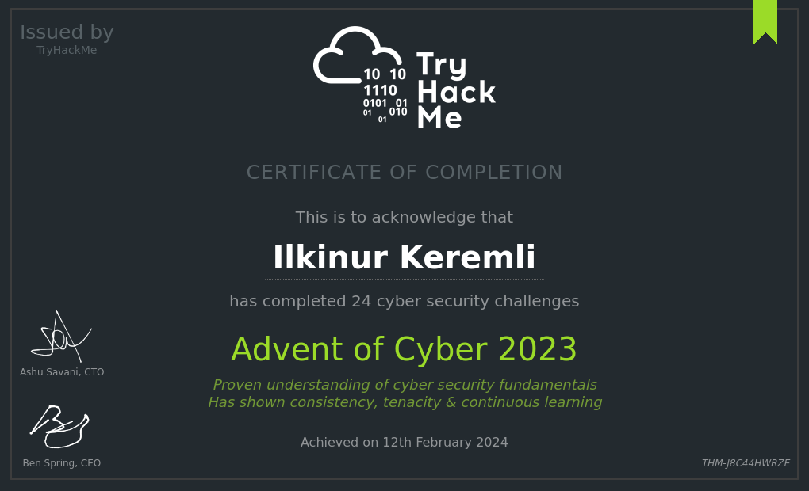
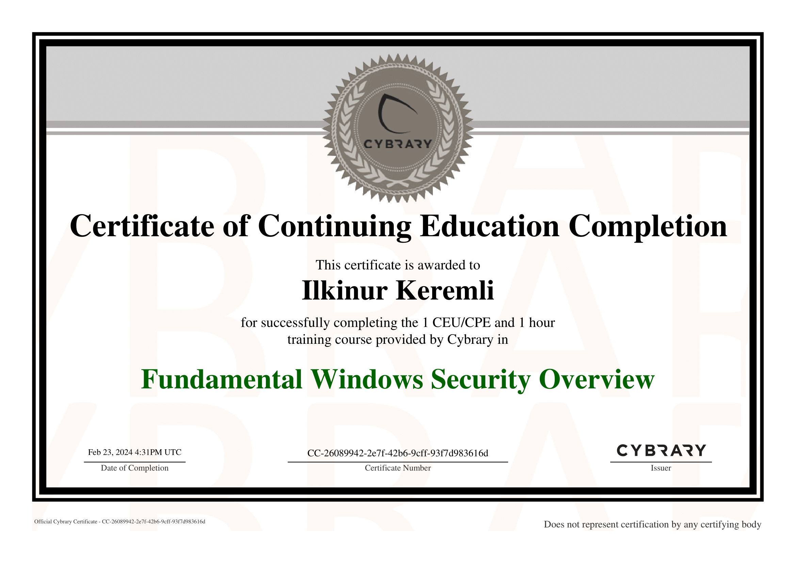
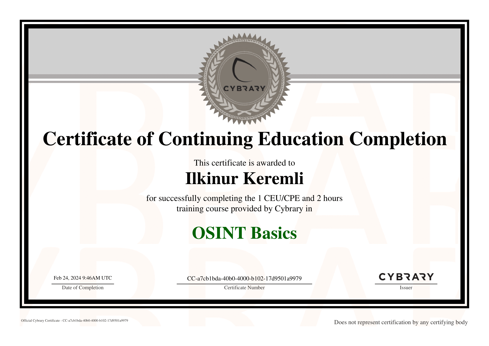

# Certificates
---

### [CompTIA Security+](https://www.credly.com/badges/629570b4-fd9c-48e9-8692-a2af5b4b9ec9)

---

### [SQL (Advanced)](https://www.hackerrank.com/certificates/c9fd30728db4)

---

### [SQL (Intermediate)](https://www.hackerrank.com/certificates/06fc74f19529)

---

### [CompTIA Pentest+ ](https://tryhackme-certificates.s3-eu-west-1.amazonaws.com/THM-WBGICNPS9Q.png)

---

### [Web Application Pentesting](https://tryhackme-certificates.s3-eu-west-1.amazonaws.com/THM-XAGSURADFI.png)

---

### [Red Teaming ](https://tryhackme-certificates.s3-eu-west-1.amazonaws.com/THM-IGU2HQTSX9.png)

---

### [Offensive Pentesting](https://tryhackme-certificates.s3-eu-west-1.amazonaws.com/THM-IWQXGXM1N7.png)

---

### [Security Engineer ](https://tryhackme-certificates.s3-eu-west-1.amazonaws.com/THM-UPI00E5PFU.png)

---

### [DevSecOps ](https://tryhackme-certificates.s3-eu-west-1.amazonaws.com/THM-0ZCQC3EE1K.png)

---

### [JavaScript (Intermediate)](https://www.hackerrank.com/certificates/4863329f663b)

---

### [Jr Penetration Tester](https://tryhackme-certificates.s3-eu-west-1.amazonaws.com/THM-FJ3KO8KQSV.png)

---

### [SOC Level 1](https://tryhackme-certificates.s3-eu-west-1.amazonaws.com/THM-CPVJ9BFRI5.png)

---

### [SOC Level 2](https://tryhackme-certificates.s3-eu-west-1.amazonaws.com/THM-MXMKN1TQR6.png)

---

### [Java (Basic)](https://www.hackerrank.com/certificates/46fa3e4f346b)

---

### [CompTIA Network+ (N10-008)](https://app.cybrary.it/courses/api/certificate/CC-4e2c2830-5f3b-4c30-b0d3-c5bbc513f211/view)

---

### [Cyber Security 101](https://tryhackme-certificates.s3-eu-west-1.amazonaws.com/THM-BDZ3YL3VHG.png)

---

### [Cyber Defense](https://tryhackme-certificates.s3-eu-west-1.amazonaws.com/THM-EH1EXTEV37.png)

---

### [Advent of Cyber 2022](https://tryhackme-certificates.s3-eu-west-1.amazonaws.com/THM-EA07RRLMAT.png)

---

### [Advent of Cyber 2023](https://tryhackme-certificates.s3-eu-west-1.amazonaws.com/THM-J8C44HWRZE.png)

---

### [Pre Security](https://tryhackme-certificates.s3-eu-west-1.amazonaws.com/THM-RSIUZBOI8Q.png)

---

### [Linux CLI Basics](https://app.cybrary.it/courses/api/certificate/CC-e9f5106d-2dbd-42f3-91a3-e3f87dda2df0/view)

---

### [Penetration Testing and Ethical Hacking](https://app.cybrary.it/courses/api/certificate/CC-b714ccbc-a2bf-409a-87ad-1a4d7a1ab124/view)

---

### [ Introduction to Cyber Security ](https://tryhackme-certificates.s3-eu-west-1.amazonaws.com/THM-IT1VLLTP32.png)

---

### [ Web Fundamentals ](https://tryhackme-certificates.s3-eu-west-1.amazonaws.com/THM-BQHQLCN6ZW.png)

---

### [JavaScript (Basic)](https://www.hackerrank.com/certificates/8d34700f6781)

---

### [ Complete Beginner ](https://tryhackme-certificates.s3-eu-west-1.amazonaws.com/THM-D9YCOKA2XQ.png)

---

### [SQL (Basic)](https://www.hackerrank.com/certificates/f7f18492bb30)

---

### [Linux Fundamentals for Security Practitioners](https://app.cybrary.it/courses/api/certificate/CC-0d73a07c-3626-433a-947b-1cf13bd56f54/view)

---

### [Fundamental Windows Security Overview](https://app.cybrary.it/courses/api/certificate/CC-26089942-2e7f-42b6-9cff-93f7d983616d/view)

---

### [OSINT Basics](https://app.cybrary.it/courses/api/certificate/CC-a7cb1bda-40b0-4000-b102-17d9501a9979/view)

---

### [CVE Series: Apache Spark (CVE-2022-33891)](https://app.cybrary.it/courses/api/certificate/CC-c2f54192-9317-47e8-b163-a88594376e38/view)

---

### [CSS (Basic)](https://www.hackerrank.com/certificates/e99d0d18cb02)

